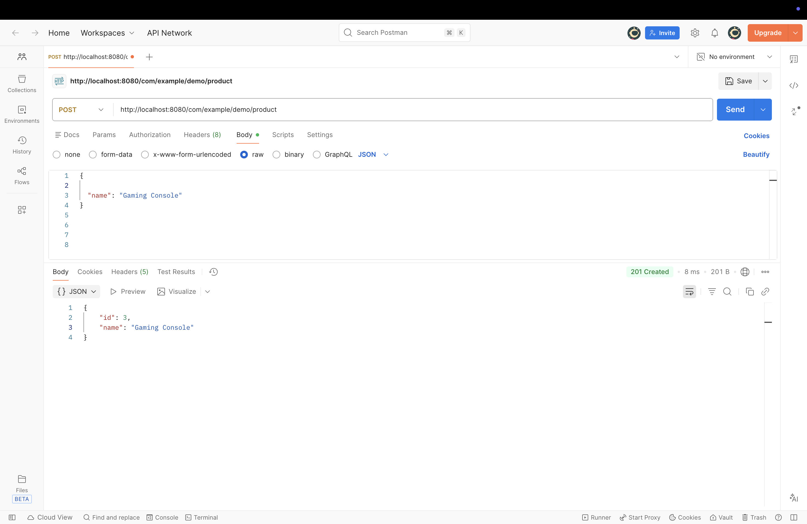
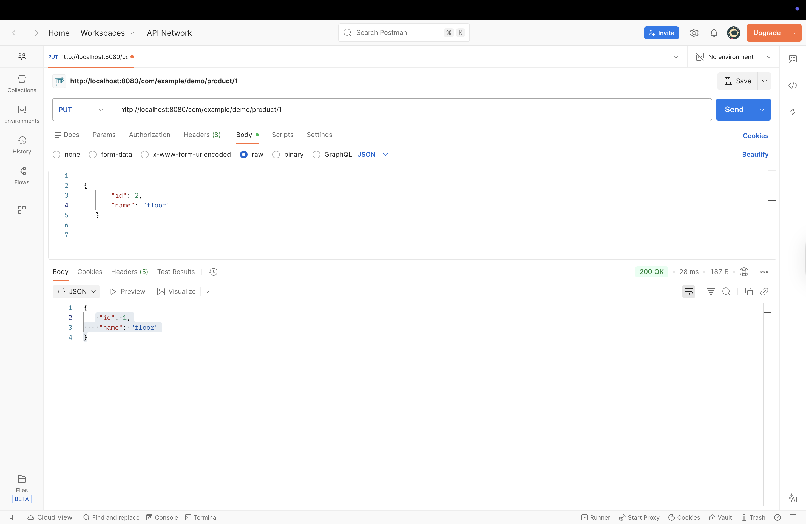
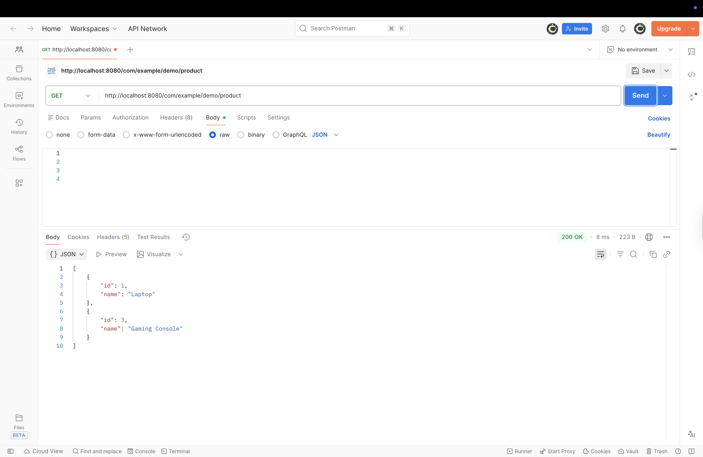
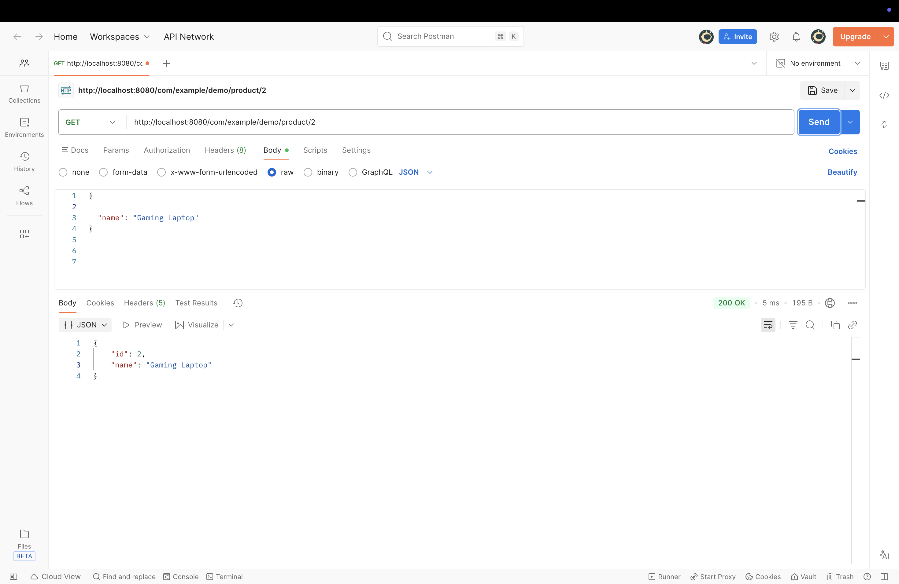
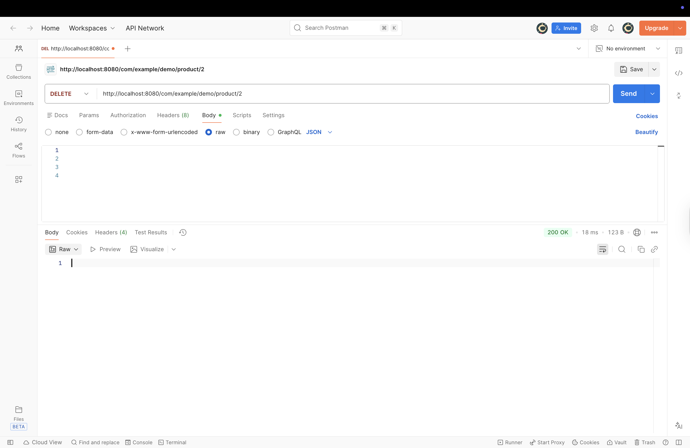
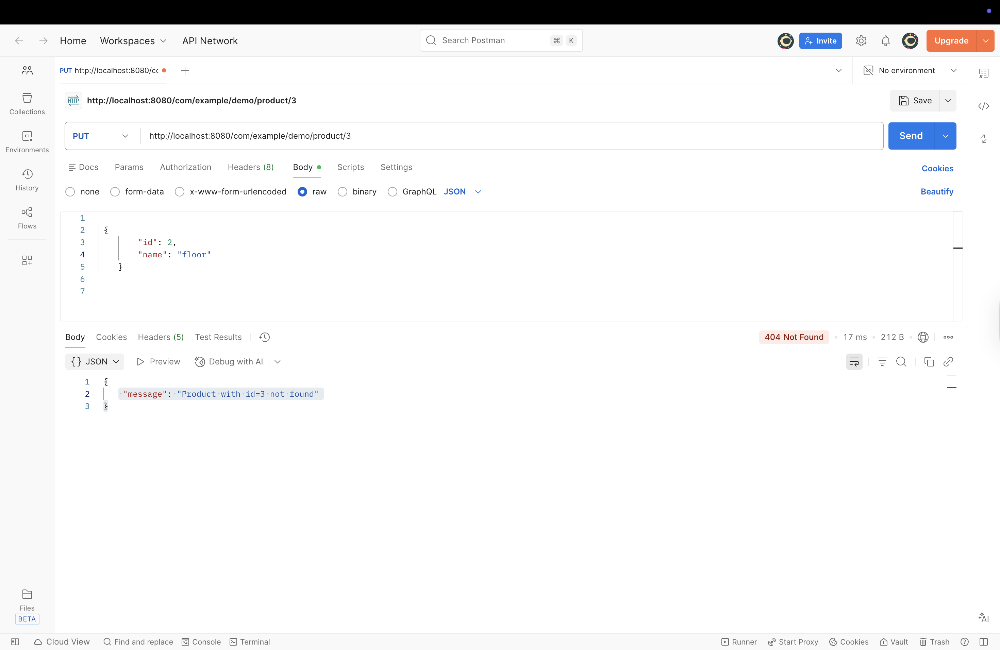
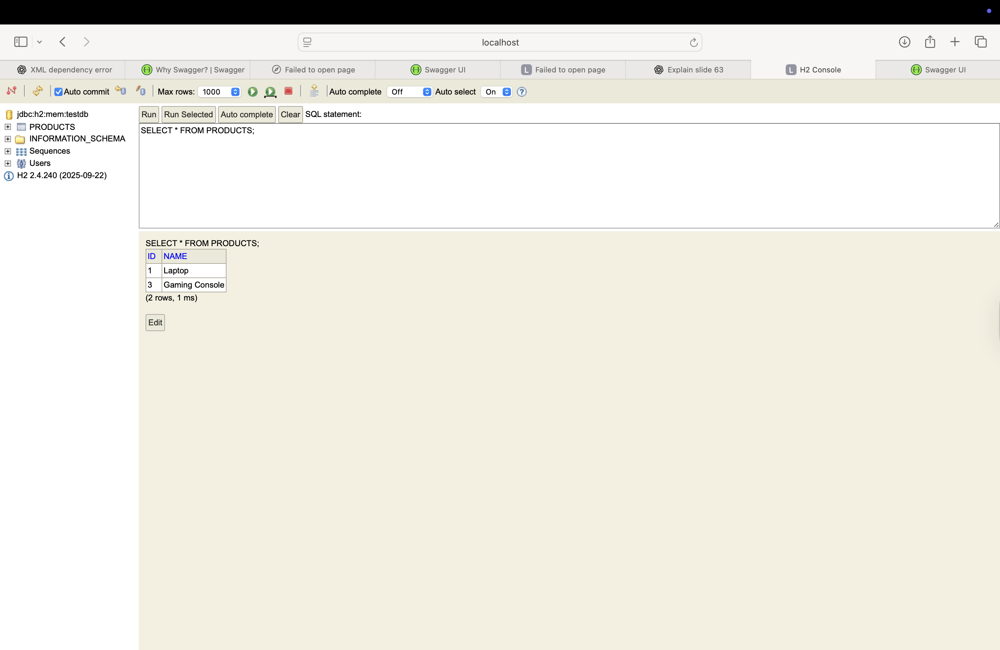

## How Task 2 Works
This task is a Spring Boot REST application that manages products.
All operations are tested using Postman.
---
### Application Startup
- The application starts from the `Application` class.
- Spring Boot runs an embedded server on port 8080.
- The API is available under the base path:
  `/com/example/demo/product`.
---
### Controller Layer
- The `ProductController` class is a REST controller.
- It defines REST endpoints for product operations.
- It handles HTTP requests such as GET, POST, PUT, and DELETE.
- Each request is forwarded to the service layer.
---
### Service Layer
- The `ProductService` class contains the business logic.
- It communicates with the database through the repository.
- It uses a mapper to convert data between request objects, entities, and response objects.
---
### Repository Layer
- The `ProductRepository` interface extends `JpaRepository`.
- It provides built-in database operations such as save, find, update, and delete.
- We did not need an SQL code is needed because Spring Data JPA handles it automatically.
---

### Domain andd DTO
- `Product` is the database entity.
- `ProductRequest` is used when creating a product.
- `UpdateProductRequest` is used when updating a product.
- `ProductResponse` is returned to the client as the API response.

---

### Mapping Logic
- The `ProductMapper` converts:
    - request objects into `Product` entities
    - `Product` entities into `ProductResponse`
- This keeps the code clean and separates logic from data models.
---
### REST Endpoints

#### Create Product
- **POST** `/com/example/demo/product`
- Creates a new product using data from the request body.
- Returns the created product.
 Screenshot:  

---

#### Update Product
- **PUT** `/com/example/demo/product/{the id that is refered}`
- Updates an existing product by ID that we send .
- Returns the updated product we the new data .

Screenshot:  

---

#### Get All Products
- **GET** `/com/example/demo/product`
- Returns a list of all products.

 Screenshot:  

---

#### Get Product by ID
- **GET** `/com/example/demo/product/{the id that is refered}`
- Returns a single product by ID.

 Screenshot:  

---

#### Delete Product
- **DELETE** `/com/example/demo/product/{the id that is refered}`
- Deletes a product by ID.

 Screenshot:  

---

### Exception Handling
- If a product is not found, a `ProductNotFoundException` is thrown.
- The `ProductExceptionAdvisor` handles this exception.
- A clear error message and HTTP 404 status are returns the mesaage that the particulkar product was not found .

Screenshot:  

---

### Database
- Products are stored in a database table named `products`.
- Each product has an `id` and a `name`.

Screenshot:  

---

### Summary
This task demonstrates a complete REST API using Spring Boot.
It includes controllers, services, repositories, mapping, exception handling, and Postman testing.
